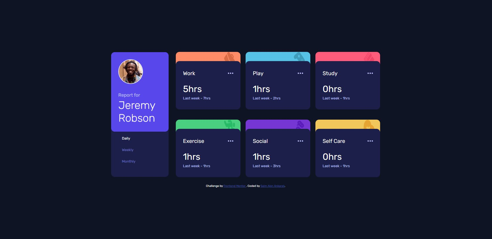

# Frontend Mentor - Time tracking dashboard solution

This is a solution to the [Time tracking dashboard challenge on Frontend Mentor](https://www.frontendmentor.io/challenges/time-tracking-dashboard-UIQ7167Jw). Frontend Mentor challenges help you improve your coding skills by building realistic projects. 

## Table of contents

- [Overview](#overview)
  - [The challenge](#the-challenge)
  - [Screenshot](#screenshot)
  - [Links](#links)
- [My process](#my-process)
  - [Built with](#built-with)
  - [What I learned](#what-i-learned)
- [Author](#author)

## Overview

### The challenge

Users should be able to:

- View the optimal layout for the site depending on their device's screen size
- See hover states for all interactive elements on the page
- Switch between viewing Daily, Weekly, and Monthly stats

### Screenshot

### Links

- Solution URL: [My Solution](https://github.com/akinankarali/time-tracking-dashboard)
- Live Site URL: [Live Site](https://saim-akin-ankarali-time-tracking-dashboard.netlify.app/)

## My process
- started create base structure like html-css files
- created component bases and added storybook
- designed components with storybook
- added components to App.jsx and added responsive styles with media queries
- added api call with axios library to data.json file
- refactor components for dynamic data
- added functionality to buttons
- deployed with Netlify and finish
### Built with

- Semantic HTML5 markup
- CSS custom properties
- CSS Grid
- [React](https://reactjs.org/) - JS library
- [Storybook](https://storybook.js.org/) - An open source tool for building UI components and pages in isolation

### What I learned

I learned with this challenge how to add the Storybook to a project and how can I use it. After that, I learned how to create reusable components. I figured out React Context usage and tried to manage button clicked and data states. I tried to use styling with CSS files and also inline CSS, in my opinion, I have some mistakes about responsive design and I should learn mobile-first styling. I managed states but I have mistakes when processing data in the Widget component, I did code repeat maybe I can fix that later.

## Author

- LinkedIn - [@akinankarali](https://www.linkedin.com/in/akinankarali/)
- Frontend Mentor - [@akinankarali](https://www.frontendmentor.io/profile/akinankarali)
- Github - [@akinankarali](https://github.com/akinankarali)
- Medium - [@saimakinankarali](https://medium.com/@saimakinankarali)